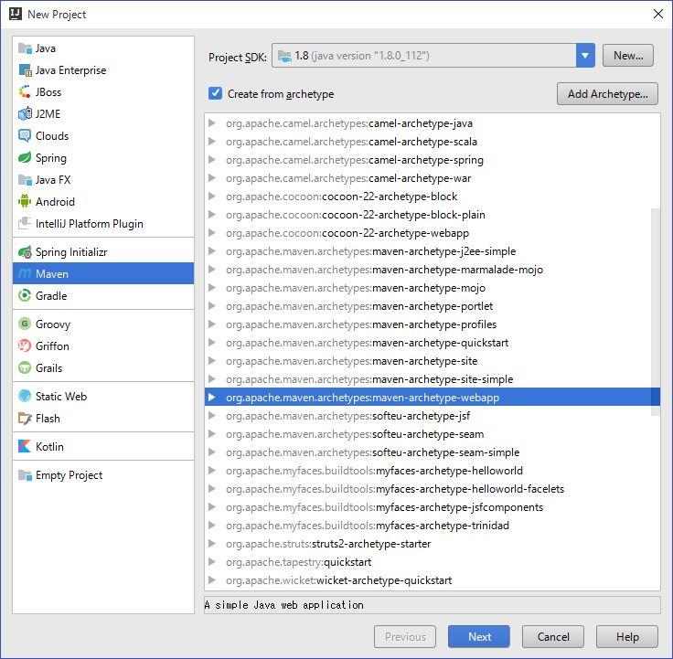
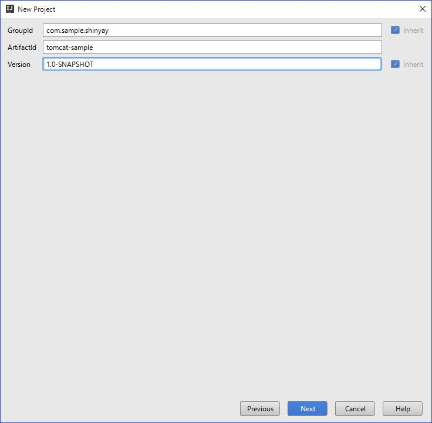
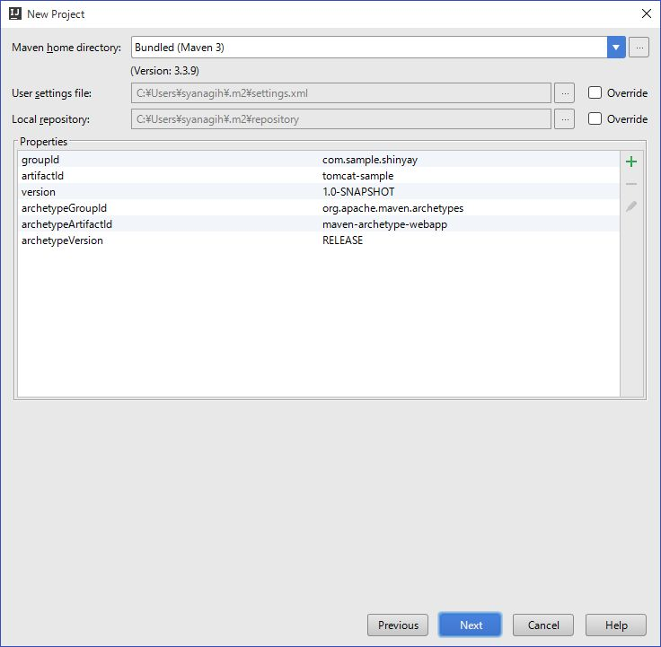
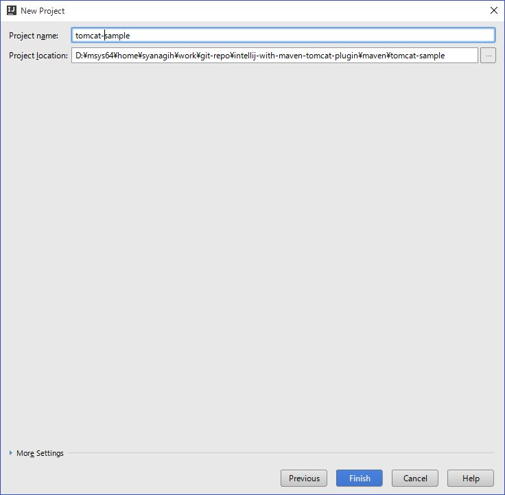
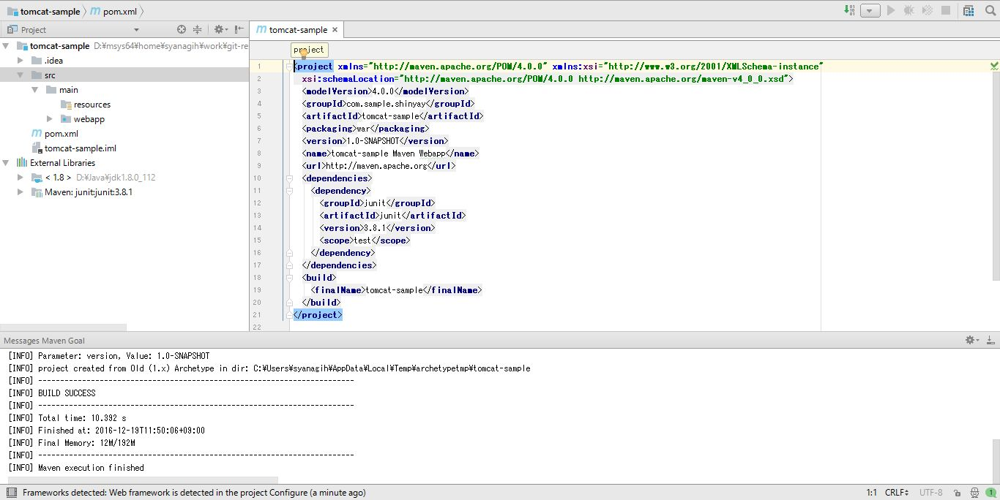
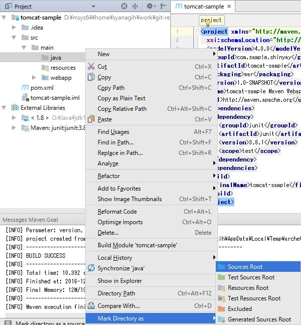
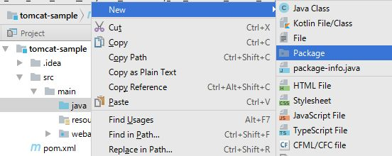
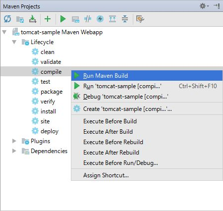
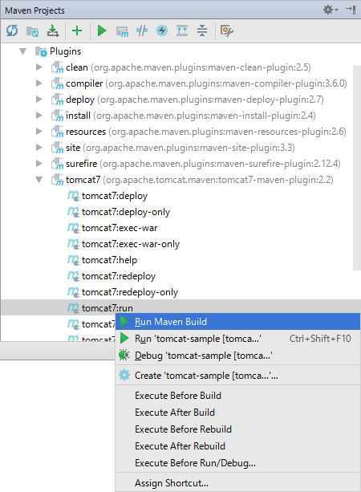

# IntelliJ IDEA を使って Web アプリケーションを Tomcat へデプロイ
---
## 説明


Tomcat は、Servlet や、JSP を実行するためのオープンソース・ソフトウェアの **Webコンテナ** (サーブレット・コンテナ / サーブレット・エンジン) です。
歴史もあり、1999年にリリースされて以来、継続的に開発が行われています。軽量で安定して稼働する事もあり、多くの技術者に利用されているソフトウェアです。

この Tomcat と統合開発環境 (IDE) を連携させて効率的に Web アプリケーション開発を行う環境を用意してみます。

環境を用意するのに使用するのは、**Maven** と **Maven-Plugin** です。そのため、開発環境は Maven が動けばいずれの IDE でも問題ないはずです。
ここでは、IntelliJ IDEA を例に行っています。

#### Tomcat のバージョンと API 仕様

Tomcat の各バージョンと、Servet / JSP のAPI 仕様の組み合わせをまとめました:

version  | Servet | JSP | JDK
---------|:------:|:---:|:--:
Tomcat 6 |  2.5   | 2.1 |  5
Tomcat 7 |  3.0   | 2.2 |  6
Tomcat 8 |  3.1   | 2.3 |  7
Tomcat 9 |  4.0   | 2.4 |  8

2016/12月時点では、Tomcat 9 は、アルファ版となっています。

## 手順

### プロジェクトの作成

Mavan プロジェクトを作成します。

**File** > **New** > **Project...** を選択します。
表示される **New Project** ダイアログで、左ペインから **Maven** を選択し、**Create from archetype** にチェックを付けて、以下の ***archetype*** を選択します。

- **org.apache.maven.archetypes:maven-archetype-webapp**




次に、**GroupId** と、**artifactId** を設定します。



MAVEN_HOME と、settings.xml 及び、Maven ローカル・リポジトリの場所を必要に応じて変更します。




プロジェクト名とプロジェクトの配置場所を適当に設定します。




以下のようにプロジェクトが作成されます。




### プロジェクトの設定

#### Java ソース・ディレクトリの作成

main ディレクトリの配下に **java** ディレクトリを作成し、それを選択して右クリックしたメニューから、**Mark Directory as** > **Sources Root** を選択します。



#### Java パッケージの作成

java ディレクトリ配下にパッケージを作成します。
java ディレクトリを右クリックして、**New** > **Package** を選択し、表示されるダイアログに適当なパッケージ名を入力します。



#### コンテンツ 配置ディレクトリの作成

**webapp** 配下に以下のディレクトリ作成します。

- css
- fonts
- js
- jsp

### pom.xml の設定

作成するアプリケーションに応じて、**pom.xml** に設定を追加します。
今回は、Servlet / JSP / JSTL を用いたアプリケーションを想定し、以下の設定を **依存ライブラリ** と、**ビルド・プラグイン** を追加します

- 依存ライブラリ
  - javax.servlet-api
  - jstl
  - tomcat-jasper
  - tomcat-jasper-el
  - tomcat-jsp-api
- ビルド・プラグイン
  - maven-compiler-plugin
  - tomcat7-maven-plugin

```xml
<properties>
  <tomcat.version>7.0.73</tomcat.version>
</properties>
<dependencies>
  <dependency>
    <groupId>junit</groupId>
    <artifactId>junit</artifactId>
    <version>3.8.1</version>
    <scope>test</scope>
  </dependency>
  <dependency>
    <groupId>junit</groupId>
    <artifactId>junit</artifactId>
    <version>3.8.1</version>
    <scope>test</scope>
  </dependency>
  <dependency>
    <groupId>javax.servlet</groupId>
    <artifactId>javax.servlet-api</artifactId>
    <version>3.0.1</version>
    <scope>provided</scope>
  </dependency>
  <dependency>
    <groupId>jstl</groupId>
    <artifactId>jstl</artifactId>
    <version>1.2</version>
  </dependency>
  <dependency>
    <groupId>org.apache.tomcat</groupId>
    <artifactId>tomcat-jasper</artifactId>
    <version>${tomcat.version}</version>
    <scope>provided</scope>
  </dependency>
  <dependency>
    <groupId>org.apache.tomcat</groupId>
    <artifactId>tomcat-jasper-el</artifactId>
    <version>${tomcat.version}</version>
    <scope>provided</scope>
  </dependency>
  <dependency>
    <groupId>org.apache.tomcat</groupId>
    <artifactId>tomcat-jsp-api</artifactId>
    <version>${tomcat.version}</version>
    <scope>provided</scope>
  </dependency>
</dependencies>
```

`<scope/>` が **provided** になっている事を注意してください。このスコープは、実行環境から対象のライブラリを提供される事を意味しています。つまり、WAR ファイルには対象のライブラリが含まれないという事です。

```xml
<plugins>
  <plugin>
    <groupId>org.apache.maven.plugins</groupId>
    <artifactId>maven-compiler-plugin</artifactId>
    <version>3.6.0</version>
    <configuration>
      <source>1.8</source>
      <target>1.8</target>
      <encoding>UTF-8</encoding>
    </configuration>
  </plugin>
  <plugin>
    <groupId>org.apache.tomcat.maven</groupId>
    <artifactId>tomcat7-maven-plugin</artifactId>
    <version>2.2</version>
    <configuration>
      <path>/</path>
    </configuration>
  </plugin>
</plugins>
```

`maven-compiler-plugin` では、使用する JDK のバージョンを　**1.8** と指定しています。
ソースコード中に、Java 8 の文法を使っているため、1.8 以外を設定するとコンパイルエラーが発生します。

`tomcat7-maven-plugin` は、tomcat の起動や、デプロイといった Tomcat のライフサイクルを制御する事が可能なプラグインです。このアプリケーションをデプロイする時の **コンテキストパス** の設定を次の箇所で行っています:

```xml
<configuration>
  <path>/</path>
</configuration>
```

上記の設定の場合は、コンテキストパスを **ルートディレクトリ** として設定しています。

### web.xml の DTD/XSD の変更

**org.apache.maven.archetypes:maven-archetype-webapp** で Web プロジェクトを作成した場合に生成される web.xml の記述は、**Servlet 2.3** の内容になっています。

今回は、Servlet 3.0 を使用するため、スキーマ宣言を変更します。

```xml
<?xml version="1.0" encoding="UTF-8"?>
<web-app xmlns="http://java.sun.com/xml/ns/javaee"
         xmlns:xsi="http://www.w3.org/2001/XMLSchema-instance"
         xsi:schemaLocation="http://java.sun.com/xml/ns/javaee
           http://java.sun.com/xml/ns/javaee/web-app_3_0.xsd"
         version="3.0">
  <display-name>Tomcat Sample Application</display-name>
</web-app>
```

#### 参考：各バージョンの DTD/XSD 宣言

##### Servlet 2.3

```xml
<!DOCTYPE web-app PUBLIC
 "-//Sun Microsystems, Inc.//DTD Web Application 2.3//EN"
 "http://java.sun.com/dtd/web-app_2_3.dtd" >

<web-app>
</web-app>
```

##### Servlet 2.4

```xml
<?xml version="1.0" encoding="UTF-8"?>
<web-app version="2.4"
         xmlns="http://java.sun.com/xml/ns/j2ee"
         xmlns:xsi="http://www.w3.org/2001/XMLSchema-instance"
         xsi:schemaLocation="http://java.sun.com/xml/ns/j2ee
         http://java.sun.com/xml/ns/j2ee/web-app_2_4.xsd" >

</web-app>
```

##### Servlet 2.5

```xml
<?xml version="1.0" encoding="UTF-8"?>
<web-app xmlns="http://java.sun.com/xml/ns/javaee"
           xmlns:xsi="http://www.w3.org/2001/XMLSchema-instance"
           xsi:schemaLocation="http://java.sun.com/xml/ns/javaee
           http://java.sun.com/xml/ns/javaee/web-app_2_5.xsd"
           version="2.5">

</web-app>
```

##### Servlet 3.0

```xml
<?xml version="1.0" encoding="UTF-8"?>
<web-app xmlns="http://java.sun.com/xml/ns/javaee"
           xmlns:xsi="http://www.w3.org/2001/XMLSchema-instance"
           xsi:schemaLocation="http://java.sun.com/xml/ns/javaee
           http://java.sun.com/xml/ns/javaee/web-app_3_0.xsd"
           version="3.0">

</web-app>
```

##### Servlet 3.1

```xml
<?xml version="1.0" encoding="UTF-8"?>
<web-app xmlns="http://xmlns.jcp.org/xml/ns/javaee"
         xmlns:xsi="http://www.w3.org/2001/XMLSchema-instance"
         xsi:schemaLocation="http://xmlns.jcp.org/xml/ns/javaee
         http://xmlns.jcp.org/xml/ns/javaee/web-app_3_1.xsd"
         version="3.1">
</web-app>
```

### アプリケーションの開発

アプリケーションの実装については省略します。
ソースコードは、以下にコミットしています:

- Java
 - https://github.com/shinyay/intellij-with-maven-tomcat-plugin/tree/master/maven/employees-app/src/main/java/com/oracle/jp/shinyay/employees
- Web コンテント
 - https://github.com/shinyay/intellij-with-maven-tomcat-plugin/tree/master/maven/employees-app/src/main/webapp

上記ファイルをそれぞれ、java ディレクトリ配下、webappディレクトリ配下に配置します。

ソースコードを見ると分かりますが、UI は、**[Bootstrap](https://github.com/twbs/bootstrap/releases/download/v3.3.7/bootstrap-3.3.7-dist.zip)** を使用しています。

### アプリケーションのビルド

Maven を使用して、アプリケーションのビルドを行います。

#### Maven Tool Window の表示

**View** > **Tool Windows** > **Maven Projects** を選択します


#### コンパイルの実施

**Lifecycle** に含まれている **compile** を右クリックし、***Run Maven Build*** を選択します。これにより、target ディレクトリ配下に class ファイルが生成されます。




#### Tomcatの起動 及び アプリケーションのデプロイ

**Plugins** に含まれている **tomcat7** を展開し、**tomcat7:run** を右クリックし、***Run Maven Build*** を選択します。




以下のようなログが出力され、Tomcat が起動し、同時にアプリケーションがデプロイされます。

```
D:\Java\jdk1.8.0_112\bin\java -Dmaven.multiModuleProjectDirectory=D:\msys64\home\syanagih\work\git-repo\intellij-with-maven-tomcat-plugin\maven\tomcat-sample -Dmaven.home=D:\msys64\home\syanagih\.sdkman\candidates\maven\current -Dclassworlds.conf=D:\msys64\home\syanagih\.sdkman\candidates\maven\current\bin\m2.conf -Didea.launcher.port=7533 -Didea.launcher.bin.path=D:\Apps\IntellJ\bin -Dfile.encoding=UTF-8 -classpath D:\msys64\home\syanagih\.sdkman\candidates\maven\current\boot\plexus-classworlds-2.5.2.jar;D:\Apps\IntellJ\lib\idea_rt.jar com.intellij.rt.execution.application.AppMain org.codehaus.classworlds.Launcher -Didea.version=2016.3.1 -s D:\msys64\home\syanagih\.sdkman\candidates\maven\current\conf\settings.xml org.apache.tomcat.maven:tomcat7-maven-plugin:2.2:run
[INFO] Scanning for projects...
[WARNING]
[WARNING] Some problems were encountered while building the effective model for com.sample.shinyay:tomcat-sample:war:1.0-SNAPSHOT
[WARNING] 'dependencies.dependency.(groupId:artifactId:type:classifier)' must be unique: junit:junit:jar -> duplicate declaration of version 3.8.1 @ line 20, column 17
[WARNING]
[WARNING] It is highly recommended to fix these problems because they threaten the stability of your build.
[WARNING]
[WARNING] For this reason, future Maven versions might no longer support building such malformed projects.
[WARNING]
[INFO]                                                                         
[INFO] ------------------------------------------------------------------------
[INFO] Building tomcat-sample Maven Webapp 1.0-SNAPSHOT
[INFO] ------------------------------------------------------------------------
[INFO]
[INFO] >>> tomcat7-maven-plugin:2.2:run (default-cli) > process-classes @ tomcat-sample >>>
[INFO]
[INFO] --- maven-resources-plugin:2.6:resources (default-resources) @ tomcat-sample ---
[WARNING] Using platform encoding (UTF-8 actually) to copy filtered resources, i.e. build is platform dependent!
[INFO] Copying 0 resource
[INFO]
[INFO] --- maven-compiler-plugin:3.6.0:compile (default-compile) @ tomcat-sample ---
[INFO] Nothing to compile - all classes are up to date
[INFO]
[INFO] <<< tomcat7-maven-plugin:2.2:run (default-cli) < process-classes @ tomcat-sample <<<
[INFO]
[INFO] --- tomcat7-maven-plugin:2.2:run (default-cli) @ tomcat-sample ---
[INFO] Running war on http://localhost:8080/
[INFO] Creating Tomcat server configuration at D:\msys64\home\syanagih\work\git-repo\intellij-with-maven-tomcat-plugin\maven\tomcat-sample\target\tomcat
[INFO] create webapp with contextPath:
12 19, 2016 1:56:09 午後 org.apache.coyote.AbstractProtocol init
情報: Initializing ProtocolHandler ["http-bio-8080"]
12 19, 2016 1:56:09 午後 org.apache.catalina.core.StandardService startInternal
情報: Starting service Tomcat
12 19, 2016 1:56:09 午後 org.apache.catalina.core.StandardEngine startInternal
情報: Starting Servlet Engine: Apache Tomcat/7.0.47
12 19, 2016 1:56:12 午後 org.apache.coyote.AbstractProtocol start
情報: Starting ProtocolHandler ["http-bio-8080"]
```

ログ中に表示されているように、

`[INFO] Running war on http://localhost:8080/`

8080 ポートで Tomcat がリッスンしています。ブラウザからアクセスしてみます。


アプリケーションが起動している事が確認できました。


## まとめ

Maven を使って Tomcat を操作する事で、IDE からも容易に操作が行えるようになります。デプロイの都度、WAR ファイルをデプロイするような作業がなくなるので効率的に開発とテストが行えるようになります。
